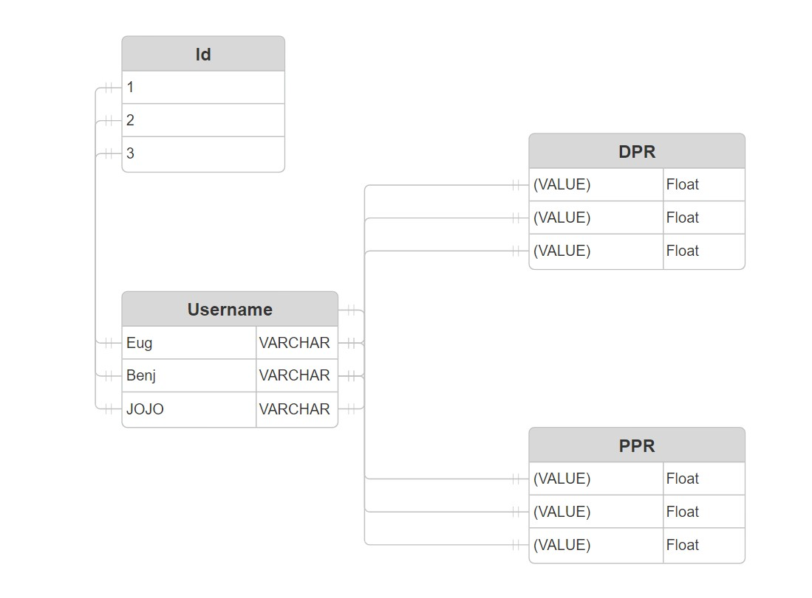

# Backyard Tally

# Deploymemt Link
   https://capston1-1.onrender.com
   
Backyard Tally is the ultimate online leaderboard and scorekeeper for cornhole enthusiasts, designed to bring a competitive edge to every backyard game. With real-time scoring, detailed player stats, and custom leaderboards, it’s never been easier to track your victories and climb the ranks. Share your wins, revisit match history, and even compete globally—all from a sleek, mobile-friendly platform. Whether you're playing casually with friends or vying for top bragging rights, Backyard Tally ensures every toss counts. Let the games begin! 🎯

## Stack Focus

Backyard Tally will be a full-stack application with an even focus on frontend and backend development.

- **Backend:** Built with Flask and Python to manage and manipulate data stored in a PostgreSQL database.
- **Frontend:** Developed using a combination of jQuery, Jinja templating, JavaScript, HTML, and CSS.

## Type

Backyard Tally will primarily function as a website, specifically designed to be fully compatible with mobile devices. This strategy guarantees that users can effortlessly access its features, regardless of whether they are utilizing a computer, tablet, or smartphone.

## Goal

The primary aim of Backyard Tally is to deliver an inclusive, user-friendly, and efficient application tailored for cornhole enthusiasts. While it is designed to be accessible for beginners, the app also incorporates features that appeal to seasoned players. These features encompass comprehensive statistics and analytics, enabling players to establish mental objectives and refine their skills progressively.

By monitoring essential performance metrics, Backyard Tally seeks to enrich the cornhole experience, rendering it more engaging and competitive.

## Users

The main target audience for Backyard Tally consists of cornhole players; however, its functionality extends to anyone who can appreciate its features. Importantly, the concept was inspired by and created with my father as the principal user in consideration.

## Data

Backyard Tally will prioritize the collection and analysis of player data to deliver valuable insights. The primary data points to be examined include:

- **Accuracy:** Measuring the frequency with which players successfully hit their targets.  
- **PPR (Points Per Round):** Evaluating scoring efficiency.  
- **DPR (Difference of Points Per Round):** Assessing point differentials to gauge competitive balance.  
- **Games Played:** Documenting overall participation levels.  

This information will be analyzed to provide tailored insights and benchmarks for enhancement.

## API

To achieve seamless integration and ensure the flexibility of data handling, I will most likely be developing my own API. This custom API will be tailored to the unique requirements of Backyard Tally, allowing efficient data management and retrieval.

## ERD Diagram

## Dependencies

flask
flask_sqlalchemy
flask_cors

# Database
sqlalchemy
psycopg2

# Testing
pytest

# Other utilities
requests
jinja2

## Game Instructions

It’s very straightforward and pretty much runs itself:

1. Add user.
2. Select user in dropdown.
3. Start timer (round cannot end until timer is paused):
   - You have 4 bags to use:
     - Bag in = 3 points
     - Bag on = 1 point(s)
4. Once the round is over, it will automatically tally up your score:
   - Scoring is differential. If Player 1 has 8 and Player 2 has 5, then Player 1 will earn 3 overall points.
   - No limit to timer or number of rounds.
5. Over time, the Stats Board will be updated with DPR and PPR:
   - **DPR:** Differential points per round (basically your score).
   - **PPR:** Points per round (efficiency).
6. Once done, click ‘Game End’ for the stats and data to be tallied up and saved.

## Steps to run
   # Backend
   1. setup venv313  'source ven313/bin/activate' 
   2. 'pip install requirements.txt' into Ubuntu to download technologies
   3. 'python DB.py' in terminal to start serve
   # Frontend

## Key Features

1. Completely free.
2. UI is much more streamlined and easier on the eyes.
3. Stats and all the math are done for you, so all you have to do is play!